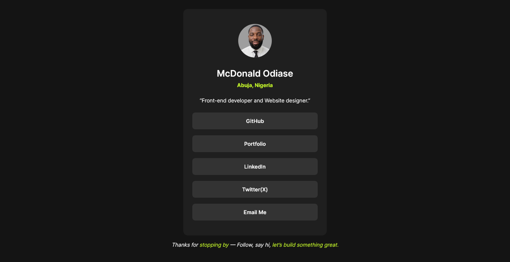

# Social Links Profile

A pixel-perfect implementation of the **Social Links Profile** challenge, built using **pure HTML and CSS**.  
This project focuses on translating a static design into an exact visual replica while maintaining clean, semantic markup and responsive behavior.

## 📸 PREVIEW

| Desktop |
|-------|
|   

A centered profile card featuring:
- Profile image
- Name and location
- Short bio
- A list of social profile links with hover states

The layout adapts seamlessly between **mobile (375px)** and **desktop (1440px)** viewports.

## 📂 PROJECT STRUCTURE

social-links-profile/
├── assets/
│   ├── images/
│   └── fonts/
├── design/
│   ├── desktop-design.png
│   ├── mobile-design.jpg
│   └── active-states.jpg
├── index.html
├── style.css
├── custom-style.md
├── README.md
└── .gitignore (optional)

## 🔗 Live Demo

_(https://social-links-profile-mocha-beta.vercel.app/)_  

## 🛠️ Built With

- **HTML5** – semantic, accessible markup  
- **CSS3** – modern layout and styling  
- **CSS Variables** – for colors, fonts, spacing, and reuse  
- **Mobile-first workflow**  

> ❌ No JavaScript  
> ❌ No frameworks or libraries  
> ❌ No preprocessors  

## 📐 Design Specifications

### Layout
- **Mobile:** 375px
- **Desktop:** 1440px

### Colors
- Green: `hsl(75, 94%, 57%)`
- White: `hsl(0, 0%, 100%)`
- Grey 700: `hsl(0, 0%, 20%)`
- Grey 800: `hsl(0, 0%, 12%)`
- Grey 900: `hsl(0, 0%, 8%)`

### Typography
- Font family: **Inter**
- Weights: 400, 600, 700
- Base font size: 14px

## ♿ Accessibility Considerations

- Semantic HTML (`<main>`, `<article>`, `<nav>`)
- Sufficient color contrast for text and buttons
- Clear focus and hover states for interactive elements
- Responsive layout that remains readable on small screens

## 📝 Author

**EVOLVED**  
Frontend Developer 

## 📄 License

This project is built for practice purposes as part of a Frontend Mentor challenge.